# SideKit FAQ

> ### What is SideKit?

SideKit is an independent sideloading toolkit and platform provider.

We help hobbyists and store owners launch their own sideloading "App Store" in no time, by providing a fully customizable iOS app, a personalized landing page, a dashboard for operators, and the rest of the ecosystem around it.

Our iOS app includes on-device IPA signing, modification, and tweak injection & extraction, as well as serving operator-provided IPAs with server-side signing. We use the latest technologies and can proudly say it's one of the most versatile and efficient apps of its kind.

<b>📱 Screenshots — the iOS app</b>

 

| Home | Explore | Modded Games | Sources |
|:---:|:---:|:---:|:---:|
| 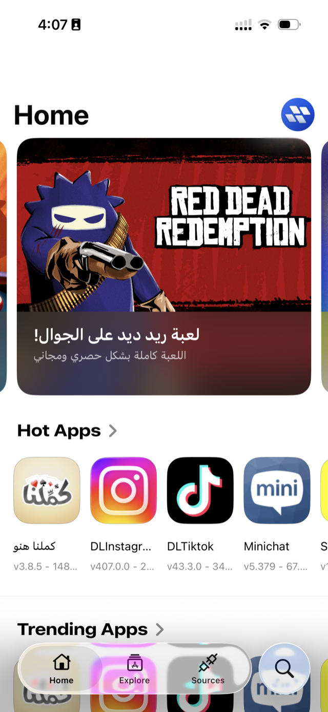 | 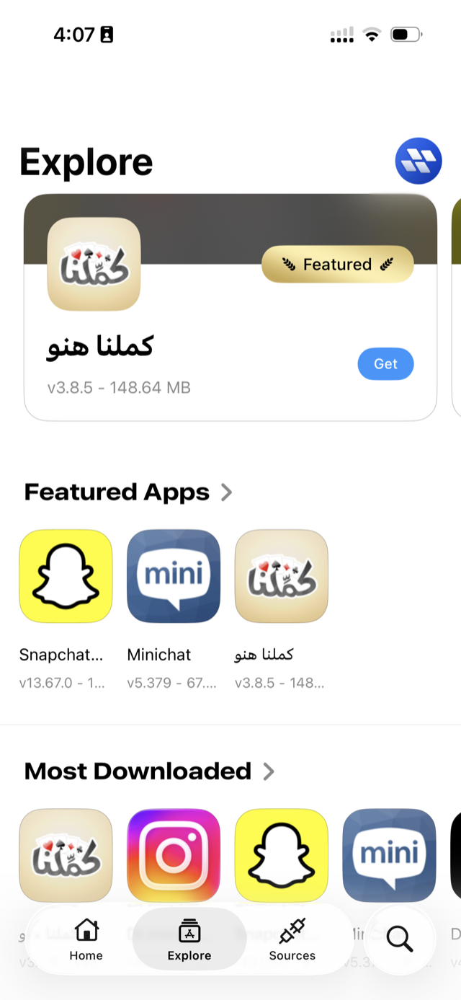 | 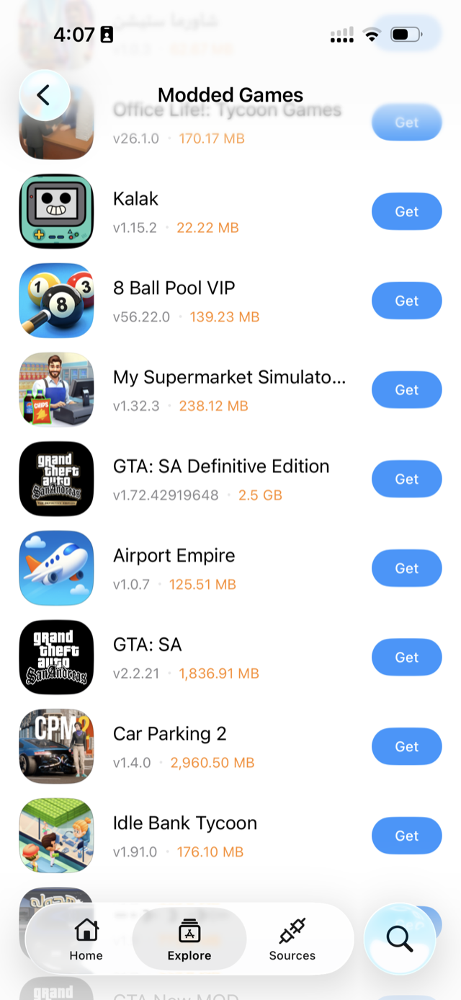 | 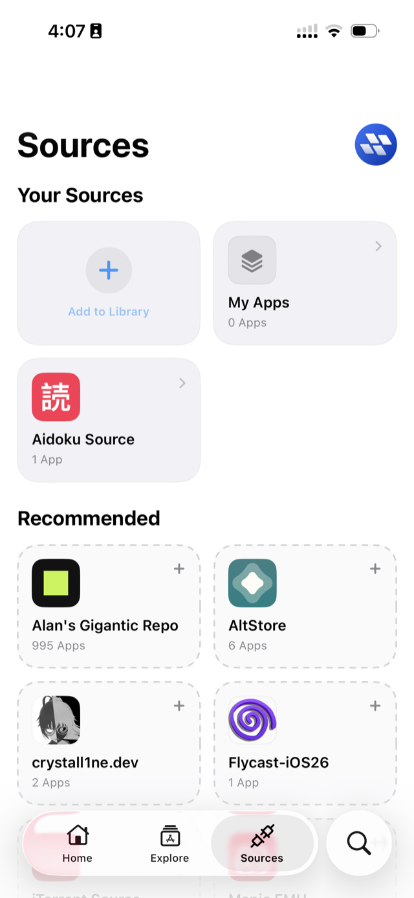 |

| Import options | Edit App | Tweaks & capabilities |
|:---:|:---:|:---:|
| 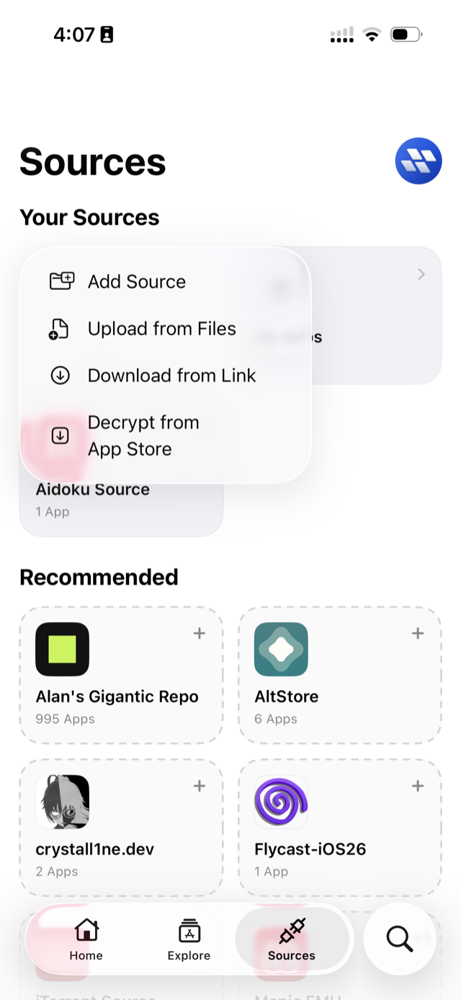 | 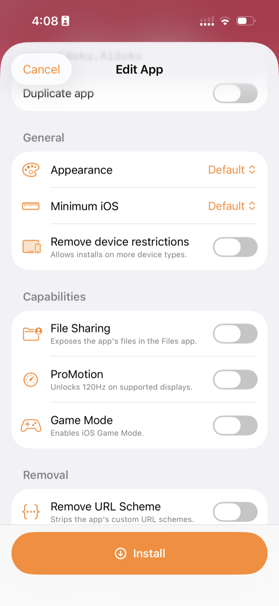 | 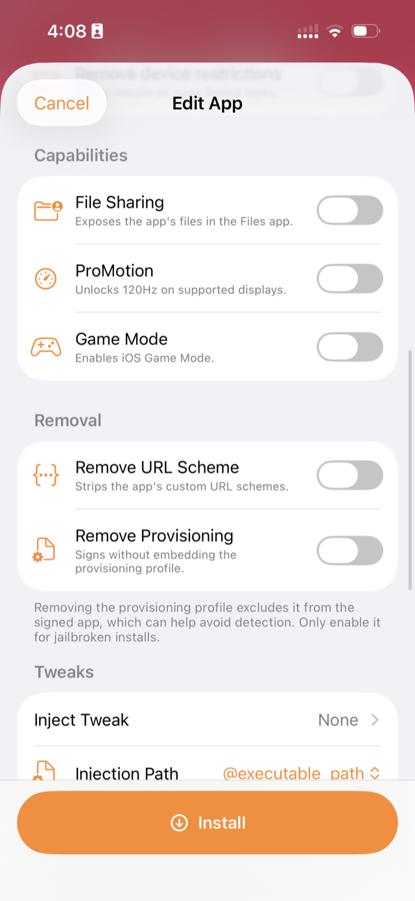 |

<b>🖥️ Screenshots — the operator dashboard</b>

 

**Overview — revenue, subscribers, and catalog at a glance**

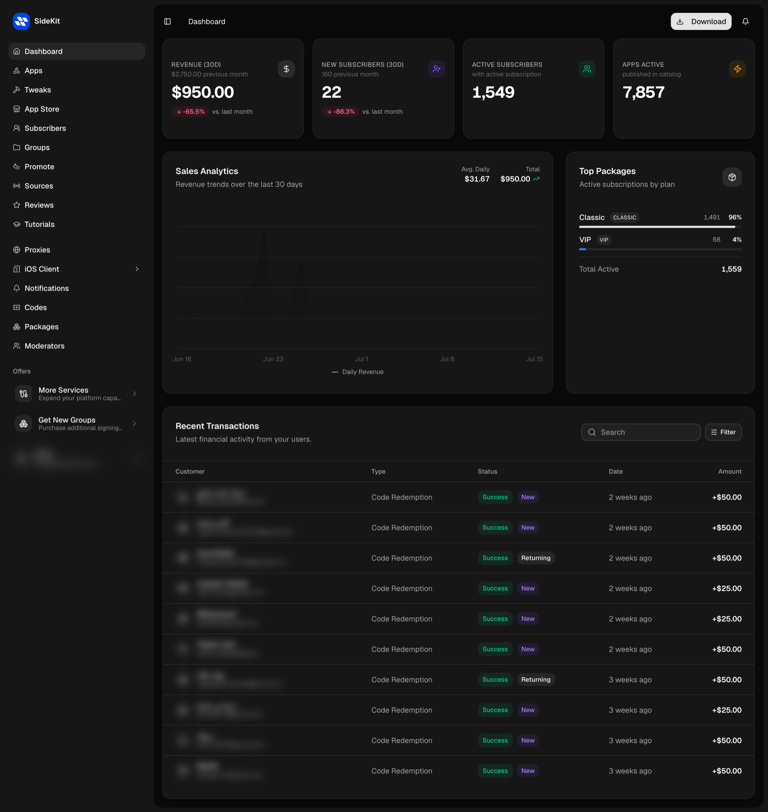

**Apps — your catalog**

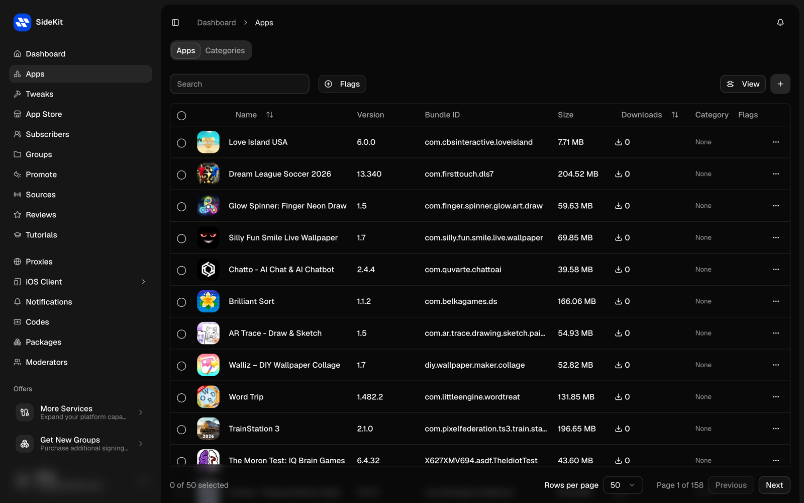

**Categories**

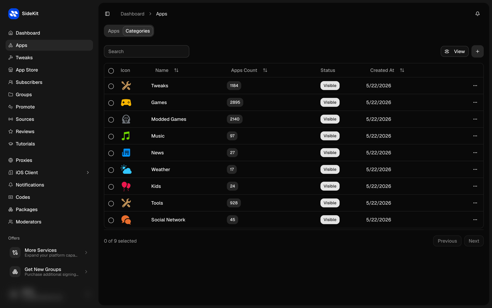

**Subscribers — devices, plans, and status**

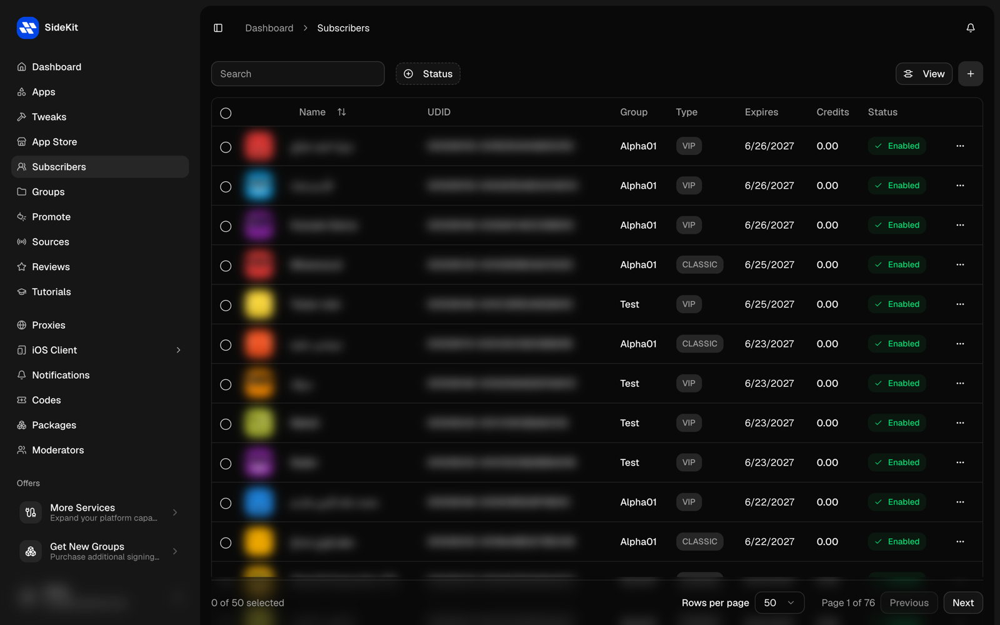

**iOS app screen editor — arrange your app's sections without code**

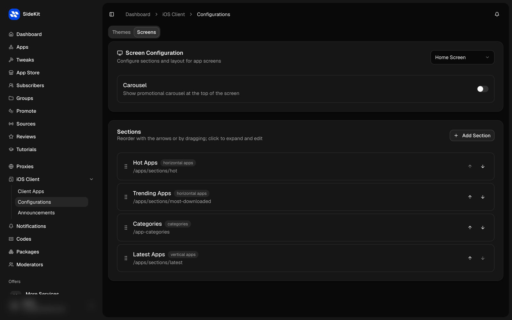

**Landing page editor — your words, in every language, with live preview**

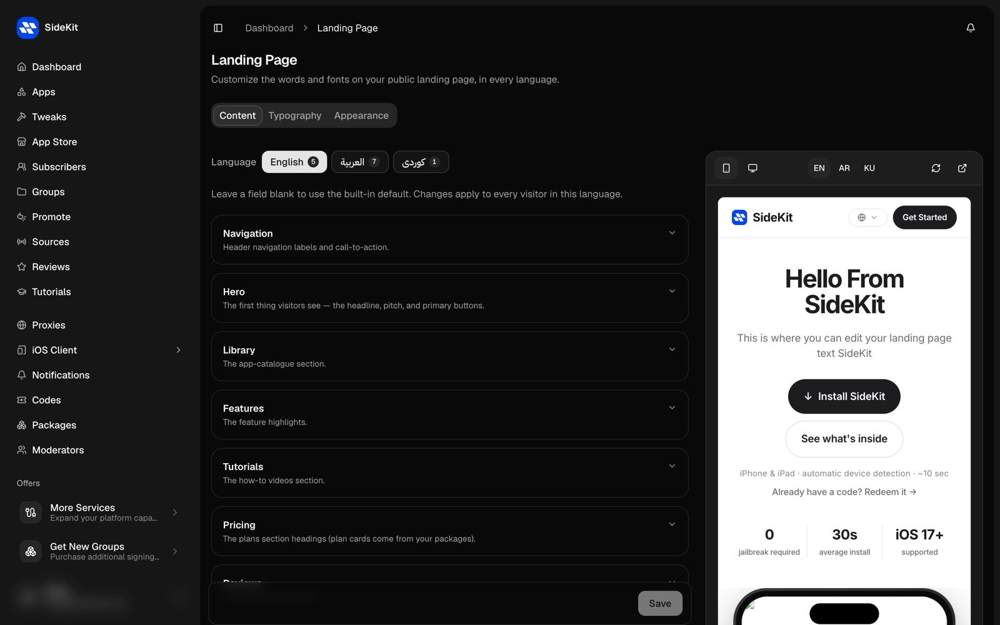

**Landing page fonts — bring your own typography**

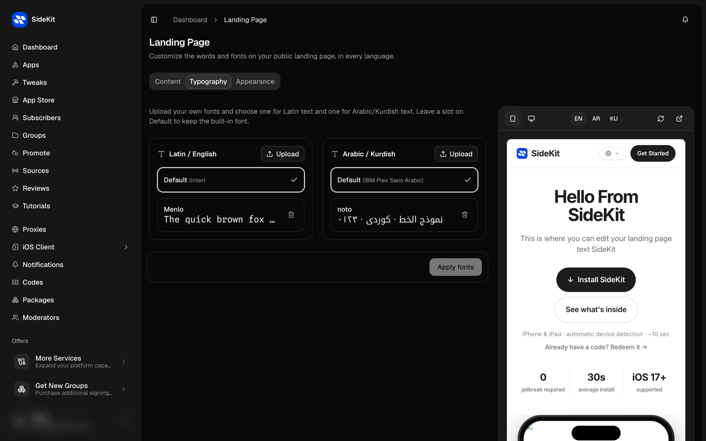

> ### Is SideKit affiliated with Apple?

No. SideKit is fully independent — not affiliated with or endorsed by Apple.

> ### What do I get as a store owner?

Your own branded iOS app, landing page, and operator dashboard, running on a dedicated server we set up for you. You also get a shared catalog of 8,000+ apps that SideKit maintains and keeps signed for your subscribers.

> ### How does signing work?

Every store runs on its own server with its own signing engine, using the Apple Developer accounts and certificates you manage. The iOS app can also sign and modify IPAs directly on-device.

> ### Do my users need a computer or a jailbreak?

No. Subscribers redeem an activation code, install your branded store app, and from there every app installs over the air with one tap.

> ### Do you take a cut of my revenue?

Never. Flat monthly pricing — charge your subscribers however you want and keep 100%.

> ### How do I get started?

Visit [sidekit.pro](https://sidekit.pro) or message us on [WhatsApp](https://wa.me/9647819966727).
